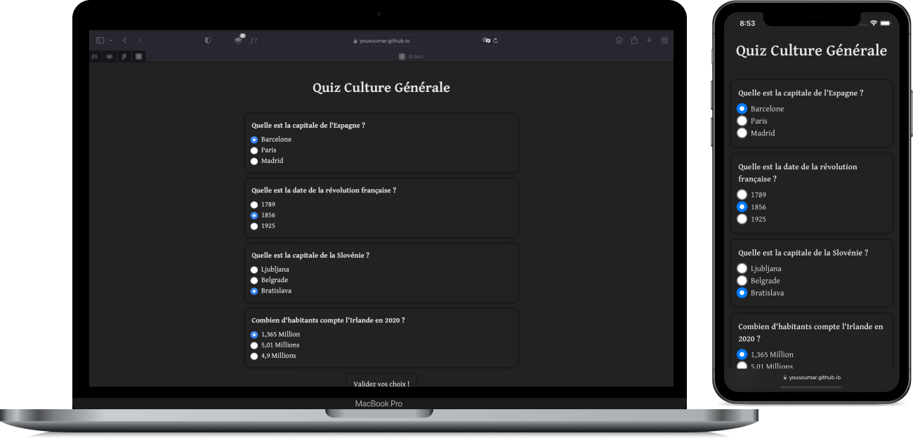

Il s'agit de coder un quiz en `HTML`, `CSS`, et `JavaScript`.

Visiter en cliquant sur l'image ci-dessous ou sur le lien en bas de la section `About`.

<a href = "https://yousoumar.github.io/js-quiz/"></img><a>
